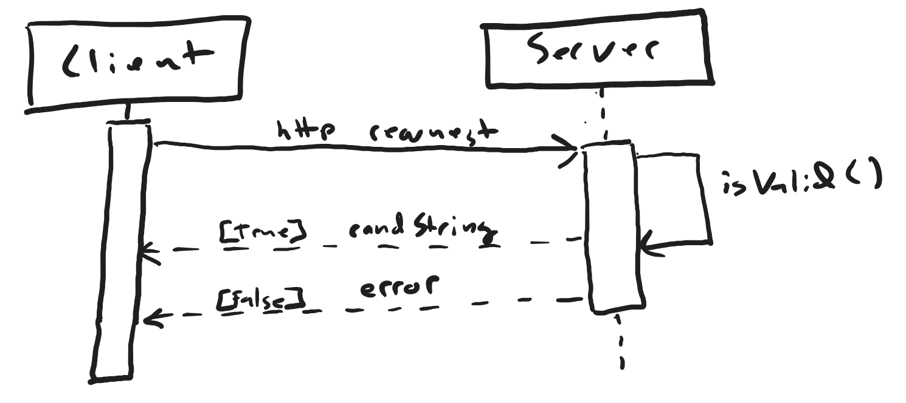

# rand-string microservice
Microservice for CS 361.  

Receives an http POST request with JSON payload containing `{"length": value}`, where `value` can be converted to an integer.  

Responds with JSON payload containing `{"string": randString}`, where `randString` is a string of `value` random characters.

- [Directions](#to-use)  
- [Examples](#example-exchanges)  
- [UML diagram](#uml-diagram)

## To use
- run `npm install` from `/rand-string`
- run `npm start` from `/rand-string`
- send a `POST` request to `http://localhost:8000` containing a `{"length": value}` json payload

## Example exchanges
```http
POST http://localhost:8000 HTTP/1.1
User-Agent: vscode-restclient
content-type: application/json
accept-encoding: gzip, deflate
content-length: 21

{
  "length": 6
}


HTTP/1.1 200 OK
X-Powered-By: Express
Content-Type: application/json; charset=utf-8
Content-Length: 19
ETag: W/"13-kWXrotTqQSTAD7C1+WXppCvgNAs"
Date: Sat, 18 Nov 2023 21:24:34 GMT
Connection: close

{
  "string": "2yAcWp"
}
```

```http
POST http://localhost:8000 HTTP/1.1
User-Agent: vscode-restclient
content-type: application/json
accept-encoding: gzip, deflate
content-length: 23

{
  "length": "4"
}


HTTP/1.1 200 OK
X-Powered-By: Express
Content-Type: application/json; charset=utf-8
Content-Length: 17
ETag: W/"11-mtgjSvV+H+ggBw5uCR9prsDBXjY"
Date: Sat, 18 Nov 2023 21:35:46 GMT
Connection: close

{
  "string": "vbrv"
}
```

```http
POST http://localhost:8000 HTTP/1.1
User-Agent: vscode-restclient
content-type: application/json
accept-encoding: gzip, deflate
content-length: 24

{
  "length": true
}


HTTP/1.1 200 OK
X-Powered-By: Express
Content-Type: application/json; charset=utf-8
Content-Length: 14
ETag: W/"e-51NQkB132Ni3nmt4U04dRWr0mjk"
Date: Sat, 18 Nov 2023 21:36:37 GMT
Connection: close

{
  "string": "j"
}
```

```http
POST http://localhost:8000 HTTP/1.1
User-Agent: vscode-restclient
content-type: application/json
accept-encoding: gzip, deflate
content-length: 22

{
  "length": -7
}


HTTP/1.1 200 OK
X-Powered-By: Express
Content-Type: application/json; charset=utf-8
Content-Length: 20
ETag: W/"14-So36dGzNZ1WJKVAPvoyH3xhgbhg"
Date: Sat, 18 Nov 2023 21:37:08 GMT
Connection: close

{
  "string": "JmZEkqB"
}
```

```http
POST http://localhost:8000 HTTP/1.1
User-Agent: vscode-restclient
content-type: application/json
accept-encoding: gzip, deflate
content-length: 25

{
  "length": "-10"
}


HTTP/1.1 200 OK
X-Powered-By: Express
Content-Type: application/json; charset=utf-8
Content-Length: 23
ETag: W/"17-4nbpVuM0kTvC2yyB1GyXv1lN7uw"
Date: Sat, 18 Nov 2023 21:37:29 GMT
Connection: close

{
  "string": "ixASdiwzeK"
}
```

```http
POST http://localhost:8000 HTTP/1.1
User-Agent: vscode-restclient
content-type: application/json
accept-encoding: gzip, deflate
content-length: 24

{
  "length": null
}


HTTP/1.1 200 OK
X-Powered-By: Express
Content-Type: application/json; charset=utf-8
Content-Length: 13
ETag: W/"d-U8B95zDzpafoZvf06c1MB8Pvszo"
Date: Sat, 18 Nov 2023 21:44:21 GMT
Connection: close

{
  "string": ""
}
```

```http
POST http://localhost:8000 HTTP/1.1
User-Agent: vscode-restclient
content-type: application/json
accept-encoding: gzip, deflate
content-length: 22

{
  "invalidKey": 3
}


HTTP/1.1 400 Bad Request
X-Powered-By: Express
Content-Type: application/json; charset=utf-8
Content-Length: 41
ETag: W/"29-l3u/tpIHvC7fivyBVRJTvcOjxho"
Date: Sat, 18 Nov 2023 21:37:56 GMT
Connection: close

{
  "error": "invalid key or value provided"
}
```

```http
POST http://localhost:8000 HTTP/1.1
User-Agent: vscode-restclient
content-type: application/json
accept-encoding: gzip, deflate
content-length: 27

{
  "length": "true"
}


HTTP/1.1 400 Bad Request
X-Powered-By: Express
Content-Type: application/json; charset=utf-8
Content-Length: 41
ETag: W/"29-l3u/tpIHvC7fivyBVRJTvcOjxho"
Date: Sat, 18 Nov 2023 21:38:24 GMT
Connection: close

{
  "error": "invalid key or value provided"
}
```

```http
GET http://localhost:8000 HTTP/1.1
User-Agent: vscode-restclient
content-type: application/json
accept-encoding: gzip, deflate
content-length: 22

{
  "length": 6
}


HTTP/1.1 405 Method Not Allowed
X-Powered-By: Express
Content-Type: application/json; charset=utf-8
Content-Length: 31
ETag: W/"1f-urwvShMGec3x7RohvWOl0osGiiM"
Date: Sat, 18 Nov 2023 21:39:10 GMT
Connection: close

{
  "error": "invalid http method"
}
```

## UML diagram

